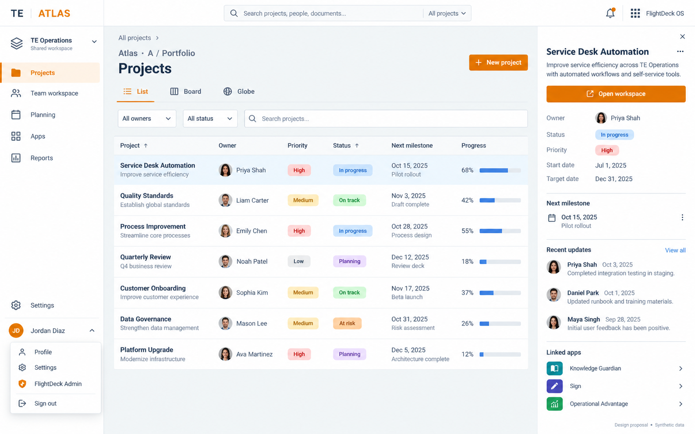
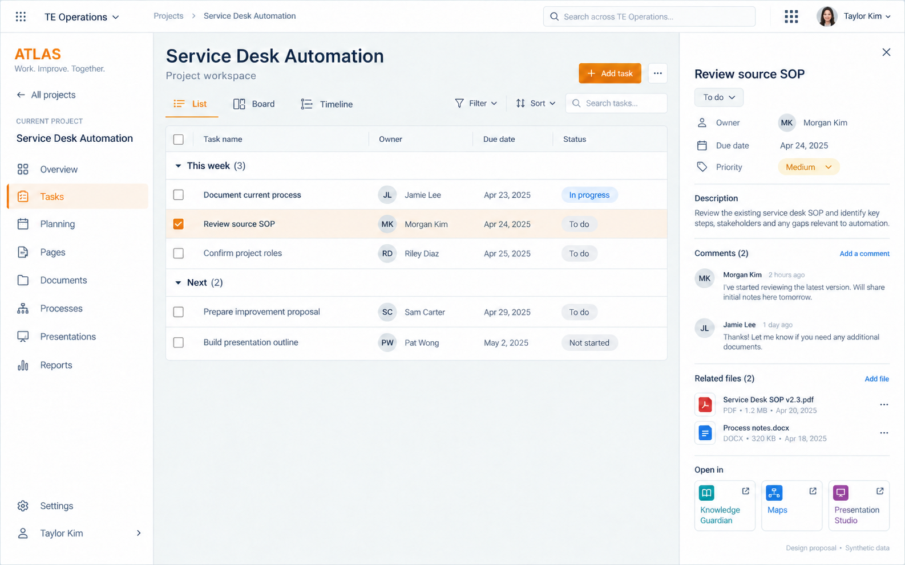

# Compact Workspace

Approved by the owner on 5 October 2026, continuing the 28 September decision
for the same layout throughout FlightDeck OS and standalone applications.

The light sidebar is 220px; the header target is 52px. Arial typography,
TE orange, pale grey surfaces, thin borders, 44px list rows and restrained
radii establish the shared family. Preserve dark themes, keyboard access,
reduced motion, workspace/project context and existing permissions.

The portfolio starts with a compact project list. Project details open beside
the accessible, filtered list; Open workspace enters the existing project
workspace. Existing cards, board, globe and configurable widgets remain
available. Task details retain the existing editor and draft handling.

These approved images contain illustrative data and controls. The application
uses actual project records and existing actions; synthetic names, counts,
statuses and proposed integrations are not requirements to invent features.

The OS repository stores the complete family and generation prompts in
`docs/design/compact-workspace/`.
